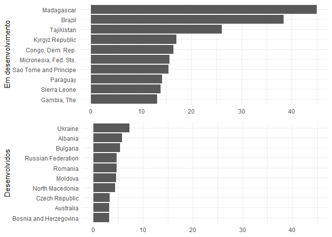

Esse ano é meu ano de monografia, e estou escrevendo sobre o spread bancário no Brasil, que é um dos mais elevados, sendo de preocupação porque trava uma economia mais guiada pelo crédito, dificultando o crescimento etc. Pensei, então, que seria bom visualizar isso. Imaginei que não seria tão difícil com a ajuda do R, e não foi mesmo.

Mas, normalmente, os dados que preciso eu pego sem sair do R e num formato já muito conveniente, com a ajuda de bibliotecas como rbcb, ipeadatar, sidrar etc. Mas, para isso em específico, eu tive que de fato sair procurando.

Acabei descobrindo que o World Bank registra a série *Interest rate spread (lending rate minus deposit rate, %)* anual para cada país. Além disso, ele colocou tudo num .csv para gente baixar.

Mas, como normalmente acontece com dados "selvagens", ele não estava *tidy*, limpo, que é o que precisamos fazer para facilitar as coisas quando usando R.

Se você não sabe, um *tidy dataset* é aquele em que cada coluna corresponde a uma variável e cada linha a uma observação, para ser sucinto.

##### Limpando os dados

Os dados eu baixei [aqui](https://data.worldbank.org/indicator/fr.inr.lndp) e o arquivo eu nomeei "spreads.csv". Vamos olhar como eles estão organizados e por que teremos que tratá-los.

``` r
library(tidyverse)
```

``` r
(dados <- read_csv("~/Blog/phelipetls.github.io/assets/spreads.csv",
                   skip = 4))
```

    ## Warning: Missing column names filled in: 'X64' [64]

    ## Parsed with column specification:
    ## cols(
    ##   .default = col_double(),
    ##   `Country Name` = col_character(),
    ##   `Country Code` = col_character(),
    ##   `Indicator Name` = col_character(),
    ##   `Indicator Code` = col_character(),
    ##   `2018` = col_logical(),
    ##   X64 = col_logical()
    ## )

    ## See spec(...) for full column specifications.

    ## # A tibble: 264 x 64
    ##    `Country Name` `Country Code` `Indicator Name` `Indicator Code` `1960`
    ##    <chr>          <chr>          <chr>            <chr>             <dbl>
    ##  1 Aruba          ABW            Interest rate s~ FR.INR.LNDP          NA
    ##  2 Afghanistan    AFG            Interest rate s~ FR.INR.LNDP          NA
    ##  3 Angola         AGO            Interest rate s~ FR.INR.LNDP          NA
    ##  4 Albania        ALB            Interest rate s~ FR.INR.LNDP          NA
    ##  5 Andorra        AND            Interest rate s~ FR.INR.LNDP          NA
    ##  6 Arab World     ARB            Interest rate s~ FR.INR.LNDP          NA
    ##  7 United Arab E~ ARE            Interest rate s~ FR.INR.LNDP          NA
    ##  8 Argentina      ARG            Interest rate s~ FR.INR.LNDP          NA
    ##  9 Armenia        ARM            Interest rate s~ FR.INR.LNDP          NA
    ## 10 American Samoa ASM            Interest rate s~ FR.INR.LNDP          NA
    ## # ... with 254 more rows, and 59 more variables: `1961` <dbl>,
    ## #   `1962` <dbl>, `1963` <dbl>, `1964` <dbl>, `1965` <dbl>, `1966` <dbl>,
    ## #   `1967` <dbl>, `1968` <dbl>, `1969` <dbl>, `1970` <dbl>, `1971` <dbl>,
    ## #   `1972` <dbl>, `1973` <dbl>, `1974` <dbl>, `1975` <dbl>, `1976` <dbl>,
    ## #   `1977` <dbl>, `1978` <dbl>, `1979` <dbl>, `1980` <dbl>, `1981` <dbl>,
    ## #   `1982` <dbl>, `1983` <dbl>, `1984` <dbl>, `1985` <dbl>, `1986` <dbl>,
    ## #   `1987` <dbl>, `1988` <dbl>, `1989` <dbl>, `1990` <dbl>, `1991` <dbl>,
    ## #   `1992` <dbl>, `1993` <dbl>, `1994` <dbl>, `1995` <dbl>, `1996` <dbl>,
    ## #   `1997` <dbl>, `1998` <dbl>, `1999` <dbl>, `2000` <dbl>, `2001` <dbl>,
    ## #   `2002` <dbl>, `2003` <dbl>, `2004` <dbl>, `2005` <dbl>, `2006` <dbl>,
    ## #   `2007` <dbl>, `2008` <dbl>, `2009` <dbl>, `2010` <dbl>, `2011` <dbl>,
    ## #   `2012` <dbl>, `2013` <dbl>, `2014` <dbl>, `2015` <dbl>, `2016` <dbl>,
    ## #   `2017` <dbl>, `2018` <lgl>, X64 <lgl>

Além de um bando de NA, veja a informação para cada ano está organizada. A cada coluna temos um ano, e o spread para cada país naquele ano. Fica bem fácil de visualizar os dados assim, mas não de trabalhar com eles no R. O que devemos observar é que todas essas colunas podem ser vistas como uma única variável, ano, e os valores também, o spread. E gostaríamos de condensar toda essa massa de dados em duas colunas, desse formato largo (*wide*) para um formato comprido (*long*).

Isso é uma tarefa muito fácil para função `tidyr::gather`. O que ela faz é reunir um monte de colunas para uma coluna só. O primeiro argumento da função pede o nome da variável das colunas, o segundo, o nome da variável dos valores, e o terceiro, quais são as colunas.

Mas, perceba também como os nomes estão sujos. O R não gosta de espaços etc. nos nomes das colunas, então temos que cuidar disso também. Faremos isso com a biblioteca janitor.

``` r
library(janitor)

(dados <- dados %>%
  clean_names %>%
  select(-x64) %>%
  gather("ano", "spread", x1960:x2018) %>%
  mutate(ano = str_remove(ano, "x"),
         ano = as.numeric(ano)) %>%
  select(-starts_with("indicator")) %>%
  na.omit())
```

    ## # A tibble: 5,225 x 4
    ##    country_name   country_code   ano spread
    ##    <chr>          <chr>        <dbl>  <dbl>
    ##  1 Japan          JPN           1960  3.87
    ##  2 Japan          JPN           1961  3.92
    ##  3 Japan          JPN           1962  4.21
    ##  4 Japan          JPN           1963  3.79
    ##  5 Japan          JPN           1964  3.90
    ##  6 Japan          JPN           1965  3.80
    ##  7 France         FRA           1966  0.350
    ##  8 Japan          JPN           1966  3.48
    ##  9 France         FRA           1967  0.350
    ## 10 United Kingdom GBR           1967  1.29
    ## # ... with 5,215 more rows

Aconteceram algumas coisas aqui. Primeiro, o `readr::read_csv` criou uma nova coluna "x64", que não me interessa então a tirei. Daí que o clean\_names prefixou um "x" às colunas com números, que também removi. E está limpo.

##### Visualização

Para visualizar, seria interessante filtrar a base antes. Por exemplo, como se compara o spread do Brasil com o de outros países da América do Sul? Para isso, vou usar [essa](https://raw.githubusercontent.com/lukes/ISO-3166-Countries-with-Regional-Codes/master/all/all.csv) base de dados:

``` r
url    <- "https://pkgstore.datahub.io/core/country-codes/country-codes_csv/data/3b9fd39bdadd7edd7f7dcee708f47e1b/country-codes_csv.csv"

paises <- read_csv(url) %>% clean_names

paises %>% glimpse
```

    ## Observations: 250
    ## Variables: 56
    ## $ official_name_ar                      <chr> NA, "<U+0623><U+0641><U+063A><U+0627><U+0646><U+0633><U+062A><U+0627><U+0646>", "<U+0623><U+0644><U+0628><U+0627><U+0646><U+064A>...
    ## $ official_name_cn                      <chr> NA, "<U+963F><U+5BCC><U+6C57>", "<U+963F><U+5C14><U+5DF4><U+5C3C><U+4E9A>", "<U+963F><U+5C14><U+53CA>...
    ## $ official_name_en                      <chr> NA, "Afghanistan", "Alba...
    ## $ official_name_es                      <chr> NA, "Afganistán", "Alban...
    ## $ official_name_fr                      <chr> NA, "Afghanistan", "Alba...
    ## $ official_name_ru                      <chr> NA, "<U+0410><U+0444><U+0433><U+0430><U+043D><U+0438><U+0441><U+0442><U+0430><U+043D>", "<U+0410><U+043B><U+0431><U+0430><U+043D>...
    ## $ iso3166_1_alpha_2                     <chr> "TW", "AF", "AL", "DZ", ...
    ## $ iso3166_1_alpha_3                     <chr> "TWN", "AFG", "ALB", "DZ...
    ## $ iso3166_1_numeric                     <chr> "158", "004", "008", "01...
    ## $ iso4217_currency_alphabetic_code      <chr> NA, "AFN", "ALL", "DZD",...
    ## $ iso4217_currency_country_name         <chr> NA, "AFGHANISTAN", "ALBA...
    ## $ iso4217_currency_minor_unit           <dbl> NA, 2, 2, 2, 2, 2, 2, 2,...
    ## $ iso4217_currency_name                 <chr> NA, "Afghani", "Lek", "A...
    ## $ iso4217_currency_numeric_code         <chr> NA, "971", "008", "012",...
    ## $ m49                                   <dbl> NA, 4, 8, 12, 16, 20, 24...
    ## $ unterm_arabic_formal                  <chr> NA, "<U+062C><U+0645><U+0647><U+0648><U+0631><U+064A><U+0629> <U+0623><U+0641><U+063A><U+0627><U+0646><U+0633><U+062A><U+0627><U+0646> <U+0627>...
    ## $ unterm_arabic_short                   <chr> NA, "<U+0623><U+0641><U+063A><U+0627><U+0646><U+0633><U+062A><U+0627><U+0646>", "<U+0623><U+0644><U+0628><U+0627><U+0646><U+064A>...
    ## $ unterm_chinese_formal                 <chr> NA, "<U+963F><U+5BCC><U+6C57><U+4F0A><U+65AF><U+5170><U+5171><U+548C><U+56FD>", "<U+963F><U+5C14><U+5DF4><U+5C3C><U+4E9A><U+5171>...
    ## $ unterm_chinese_short                  <chr> NA, "<U+963F><U+5BCC><U+6C57>", "<U+963F><U+5C14><U+5DF4><U+5C3C><U+4E9A>", "<U+963F><U+5C14><U+53CA>...
    ## $ unterm_english_formal                 <chr> NA, "the Islamic Republi...
    ## $ unterm_english_short                  <chr> NA, "Afghanistan", "Alba...
    ## $ unterm_french_formal                  <chr> NA, "République islamiqu...
    ## $ unterm_french_short                   <chr> NA, "Afghanistan (l') [m...
    ## $ unterm_russian_formal                 <chr> NA, "<U+0418><U+0441><U+043B><U+0430><U+043C><U+0441><U+043A><U+0430><U+044F> <U+0420><U+0435><U+0441><U+043F><U+0443><U+0431><U+043B><U+0438><U+043A>...
    ## $ unterm_russian_short                  <chr> NA, "<U+0410><U+0444><U+0433><U+0430><U+043D><U+0438><U+0441><U+0442><U+0430><U+043D>", "<U+0410><U+043B><U+0431><U+0430><U+043D>...
    ## $ unterm_spanish_formal                 <chr> NA, "República Islámica ...
    ## $ unterm_spanish_short                  <chr> NA, "Afganistán (el)", "...
    ## $ cldr_display_name                     <chr> "Taiwan", "Afghanistan",...
    ## $ capital                               <chr> "Taipei", "Kabul", "Tira...
    ## $ continent                             <chr> "AS", "AS", "EU", "AF", ...
    ## $ ds                                    <chr> "RC", "AFG", "AL", "DZ",...
    ## $ developed_developing_countries        <chr> NA, "Developing", "Devel...
    ## $ dial                                  <chr> "886", "93", "355", "213...
    ## $ edgar                                 <chr> NA, "B2", "B3", "B4", "B...
    ## $ fifa                                  <chr> "TPE", "AFG", "ALB", "AL...
    ## $ fips                                  <chr> "TW", "AF", "AL", "AG", ...
    ## $ gaul                                  <dbl> 925, 1, 3, 4, 5, 7, 8, 9...
    ## $ geoname_id                            <dbl> 1668284, 1149361, 783754...
    ## $ global_code                           <lgl> NA, TRUE, TRUE, TRUE, TR...
    ## $ global_name                           <chr> NA, "World", "World", "W...
    ## $ ioc                                   <chr> "TPE", "AFG", "ALB", "AL...
    ## $ itu                                   <chr> NA, "AFG", "ALB", "ALG",...
    ## $ intermediate_region_code              <dbl> NA, NA, NA, NA, NA, NA, ...
    ## $ intermediate_region_name              <chr> NA, NA, NA, NA, NA, NA, ...
    ## $ land_locked_developing_countries_lldc <chr> NA, "x", NA, NA, NA, NA,...
    ## $ languages                             <chr> "zh-TW,zh,nan,hak", "fa-...
    ## $ least_developed_countries_ldc         <chr> NA, "x", NA, NA, NA, NA,...
    ## $ marc                                  <chr> "ch", "af", "aa", "ae", ...
    ## $ region_code                           <dbl> NA, 142, 150, 2, 9, 150,...
    ## $ region_name                           <chr> NA, "Asia", "Europe", "A...
    ## $ small_island_developing_states_sids   <chr> NA, NA, NA, NA, "x", NA,...
    ## $ sub_region_code                       <dbl> NA, 34, 39, 15, 61, 39, ...
    ## $ sub_region_name                       <chr> NA, "Southern Asia", "So...
    ## $ tld                                   <chr> ".tw", ".af", ".al", ".d...
    ## $ wmo                                   <chr> NA, "AF", "AB", "AL", NA...
    ## $ is_independent                        <chr> "Yes", "Yes", "Yes", "Ye...

Para filtrar os países da América do Sul, teremos que pegar o código deles, porque pelos nomes há uma divergência entre as duas tabelas. Por conveniência vamos renomear a coluna que interessa.

``` r
paises <- paises %>% rename(country_code = iso3166_1_alpha_3)

(america_sul <- paises %>%
  clean_names %>%
  filter(intermediate_region_name == "South America") %>%
  pull(country_code))
```

    ##  [1] "ARG" "BOL" "BVT" "BRA" "CHL" "COL" "ECU" "FLK" "GUF" "GUY" "PRY"
    ## [12] "PER" "SGS" "SUR" "URY" "VEN"

E, com isso, podemos fazer uma visualização dos spreads na américa latina, para os anos de 2015 a 2017. No que podemos ver que o Brasil domina em termos de spread, para nossa infelicidade:

``` r
theme_set(theme_minimal())

anos = 2015:2017

dados %>%
  filter(country_code %in% america_sul,
         ano %in% anos) %>%
  mutate(country_name = fct_reorder(country_name, spread)) %>%
  ggplot(aes(x = country_name, y = spread)) +
  geom_col() +
  labs(y = "Spread", x = NULL) +
  facet_wrap(.~ano) +
  coord_flip()
```


E que tal contrastar os 15 maiores spreads de países em desenvolvimento versus desenvolvidos? Na outra tabela tem uma coluna que pode nos ajudar com isso. Para isso, fiz um join para depois filtrar e criar os gráficos que eu queria.

``` r
status_dsnv <- paises %>% select(country_code, developed_developing_countries)

df       <- left_join(dados, status_dsnv, by = "country_code") %>%
            rename(status = developed_developing_countries) %>%

indev       <- df %>%
               filter(status == "Developing", ano == 2017) %>%
               top_n(10, spread) %>%
               ggplot() +
               geom_col(aes(fct_reorder(country_name, spread), spread)) +
               labs(x = "Em desenvolvimento", y = NULL,
               title = "Países desenvolvidos e subdesenvolvidos com 10 maiores spread em 2017") +
               coord_flip()

dev       <- df %>%
               filter(status == "Developed", ano == 2017) %>%
               top_n(10, spread) %>%
               ggplot() +
               geom_col(aes(fct_reorder(country_name, spread), spread)) +
               labs(x = "Desenvolvidos", y = NULL) +
               expand_limits(y = 45) +
               coord_flip()

library(gridExtra)
grid.arrange(indev, dev, nrow = 2)
```



Vemos, assim, que a situação do Brasil é um pouco crítica quando se olha para o mercado de crédito. Está no meio de países muito pequenos ou pobres (não que o Brasil também não seja) no lado subdesenvolvido. Enquanto que no lado dos desenvolvidos, está em peso o Leste Europeu etc., antigos países soviéticos.

Não é tão claro, ao menos para mim, o porquê disso, é justamente o meu intuito entender. Se, por um lado, alguns culpam a concentração bancária, que no Brasil não é desprezível mesmo, por outro ela não nessariamente significa que o mercado não é competitivo, sendo também um fator a considerar os ganhos de eficiência que ela podem trazer as economias de escala. Se, por um lado, um problema anterior era o alto nível da Selic (ou sua volatilidade), que implica tanto um custo de oportunidade quanto um risco para os bancos (que eventualmente têm de recorrer a ela quando há descompassos entre demandas por empréstimos e ofertas de depósitos), hoje já se questiona isto, visto que a Selic está estável há meses e em níveis historicamente baixos. Outra razão pode ser a inadimplência, que realmente é considerável e da qual os bancos se protegem via spread.

Enfim, é um assunto bem instigante, que pretendo estudar mais aprofundadamente. Mas fica aqui o que esses gráficos sugerem.
