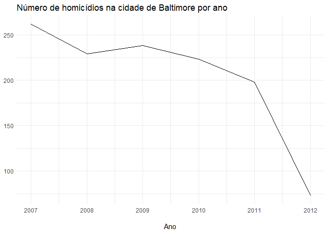
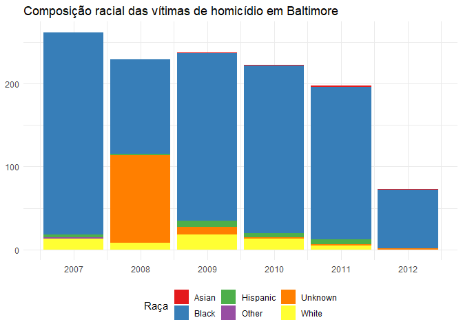
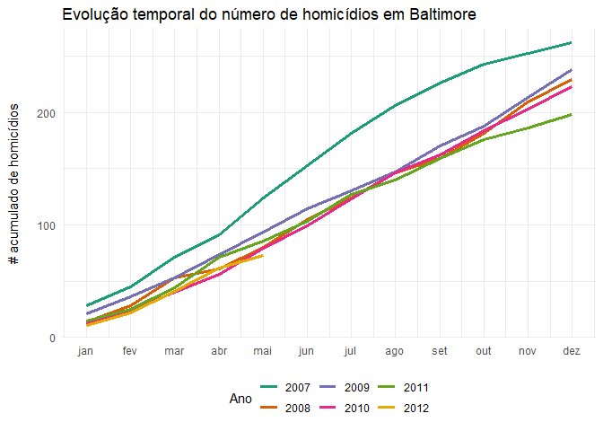
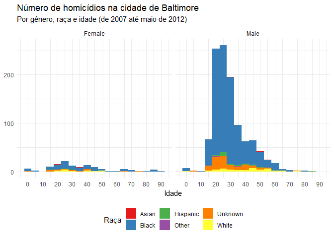
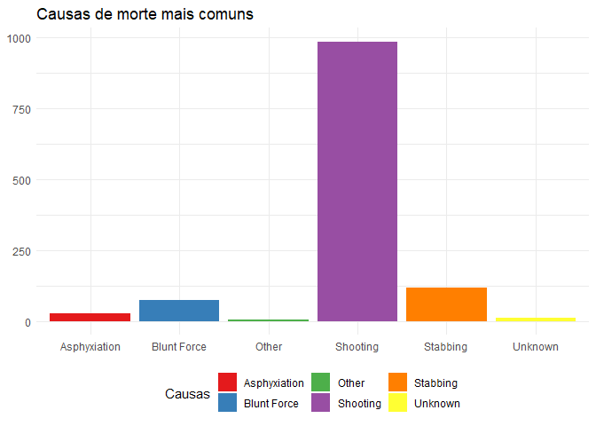
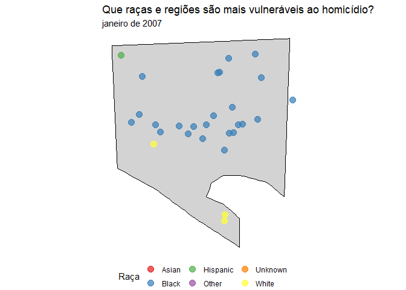
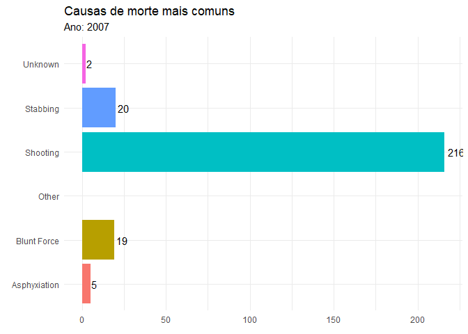
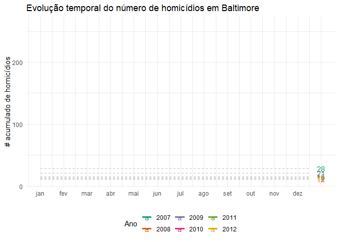

Neste post pretendo continuar o que foi iniciado no último, onde
transformamos dados contidos em texto em um data.frame, um formato muito
mais amigável para a exploração e visualização de dados no R.

O procedimento geral agora, com os dados já limpos, é transformá-los
e fazer a visualização que queremos. Daí o uso extensivo do
tidyverse antes de chamar o ggplot2.

Ok, vamos primeiro olhar para a nossa [base de
dados](https://raw.githubusercontent.com/phelipetls/phelipetls.github.io/master/assets/homicides_df.csv "Link do arquivo raw")
e ver que perguntas gostaríamos de
    responder:

``` r
library(tidyverse)

df <- read_csv("https://raw.githubusercontent.com/phelipetls/phelipetls.github.io/master/assets/homicides_df.csv") %>%
      na.omit()

df %>% head
```

    ## # A tibble: 6 x 8
    ##   causas         lon   lat raca  genero idade data       endereco
    ##   <chr>        <dbl> <dbl> <chr> <chr>  <dbl> <date>     <chr>
    ## 1 Shooting     -76.7  39.3 Black Male      17 2007-01-01 3400 Clifton Ave.
    ## 2 Shooting     -76.7  39.3 Black Male      26 2007-01-02 4900 Challedon Ro~
    ## 3 Blunt Force  -76.6  39.3 Black Female    44 2007-01-02 2000 West North A~
    ## 4 Asphyxiation -76.6  39.4 Black Male      21 2007-01-03 5900 Northwood Dr~
    ## 5 Blunt Force  -76.6  39.2 White Male      61 2007-01-05 500 Maude Ave.
    ## 6 Shooting     -76.6  39.4 Black Male      46 2007-01-05 5200 Ready Ave.

Há diversas questões a serem exploradas aqui, a primeira e mais sensível
que vem a mente é a racial: quais raças costumam ser vítimas de
homicídio? Vamos, naturalmente, estar interessados também na mesma
pergunta para diferentes características das pessoas, como gênero, idade
etc. e como elas se relacionam umas com as outras. Por exemplo, será que
mulheres negras acabam vítimas de homicídios muito mais que as brancas?

Os dados nos possibilitam também enxergar a distribuição geográfica, que
áreas da cidade são as mais violentas etc.

E, por fim, é interessante visualizar como o número de vítimas evolui no
tempo. Será que vem declinando com o passar dos anos?

###### Evolução do número de vítimas no tempo

Esse é um bom ponto para se começar a entender os dados. Vamos fazer
essa visualização com um gráfico de linhas:

``` r
library(lubridate)

# configurando o tema
theme_set(theme_minimal())
theme_update(legend.position = "bottom")

# criando a variável pro ano
df <- df %>%
  mutate(ano = year(data))

df %>%
  count(ano) %>%
  ggplot(aes(x = ano,
             y = n)) +
  geom_line() +
  labs(x = "\nAno", y = NULL,
       title = "Número de homicídios na cidade de Baltimore por ano")
```



Ok, uma boa notícia, parece que o número de homicídios vem reduzindo com
os anos…

Exceto por essa queda brusca em 2012, que deveria gerar suspeitas. De fato,
essa queda será esclarecida por outra visualização mais adiante. Se
desconsiderarmos 2012, o quadro da violência não parece apresentar
melhoras tão significativas.

É interessante visualizar também como isso se deu para as diferentes
raças:

``` r
df %>%
  # contagem dos casos por raça e ano
  count(raca, ano) %>%
  ggplot(aes(x = ano,
             y = n,
             fill = raca)) +
  geom_col() +
  labs(x = NULL, y = NULL,
       title = "Raça das vítimas de homicídios em Baltimore") +
  scale_fill_brewer(palette = "Set1", name = "Raça") +
  scale_x_continuous(breaks = 2007:2012)
```

<!-- -->

Essa é a primeira visualização do que já era esperado: na cidade de
Baltimore, a violência afeta muito mais os negros do que a qualquer
outra raça. Impressiona a magnitude da desigualdade.

Um gráfico interessante que vi
[aqui](https://homicides.news.baltimoresun.com/), foi o do crescimento
acumulado do número de vítimas por mês para cada ano, que tentei
replicar abaixo:

``` r
acumulado <- df %>%
  mutate(mes = month(data)) %>%
  count(ano, mes) %>%
  group_by(ano) %>%
  mutate(soma_cumulativa = cumsum(n)) %>%
  na.omit() %>%
  ggplot(aes(x = mes,
             y = soma_cumulativa,
             color = factor(ano),
             group = ano)) +
  scale_color_brewer(palette = "Dark2") +
  labs(x = NULL,
       y = "# acumulado de homicídios\n",
       title = "Evolução temporal dos homicídios em Baltimore",
       color = "Ano") +
  geom_line(size = 1.2) +
  scale_x_continuous(breaks = 1:12,
                     labels = month(df$data, label = T) %>% levels())


acumulado
```

<!-- -->

E aqui fica claro o porquê da queda em 2012: não temos os dados de todos
os meses. Também salta aos olhos que a violência diminuiu em relação a 2007,
mas se manteve mais ou menos estável no resto do período.

###### Aspectos sociais das vítimas

Vamos tentar visualizar agora como a violência afeta as pessoas de
diferentes grupos:

``` r
df %>%
  ggplot(aes(idade)) +
  geom_histogram(aes(fill = raca),
                 binwidth = 5) +
  facet_grid(.~genero) +
  scale_fill_brewer(palette = "Set1") +
  labs(x = "Idade", y = NULL,
       fill = "Raça",
       title = "Número de homicídios na cidade de Baltimore",
       subtitle = "Por gênero, raça e idade (de 2007 até maio de 2012)") +
  scale_x_continuous(breaks = seq(0, 100, 10))
```

<!-- -->

E assim podemos ver que o mais afetado pela violência é o homem negro da
faixa dos 20-30 anos. Se olharmos bem, pode-se também observar que a
mulher negra está em posição mais vulnerável à violência que a branca,
provavelmente porque vive nas regiões onde a violência é maior.

Também impressiona o contraste entre os números para cada gênero. Os
homens são muito mais propensos a serem mortos violentamente.

###### Que causa de morte é a mais comum?

Para ver quais são as causas mais comuns, vamos fazer um simples gráfico
de barras:

``` r
df %>%
  ggplot(aes(x = causas,
             fill = causas)) +
  geom_bar() +
  labs(x = NULL, y = NULL,
       fill = "Causas",
       title = "Causas de morte mais comuns") +
  scale_fill_brewer(palette = "Set1")
```

<!-- -->

Os homicídios por armas de fogo são de longe os mais comuns, seguido por
esfaqueamento e contusão.

###### Mapas e animações

Para visualizar a distribuição geográfica da ocorrência de homicídios,
temos que primeiro plotar o mapa da cidade. O código abaixo mostra como
fazer isso, com a ajuda do dataset `county` do pacote `maps`, de onde
extraímos as coordenadas geográficas, para depois plotar com `geom_polyon()`.

Uma vez com o mapa, minha ideia foi criar uma animação para visualizar o
aspecto temporal, espacial e qualitativo (nesse caso, pela raça das
vítimas) com um único gráfico. Para isso, vamos usar a função
`gganimate::transition_manual`, de forma a mostrar por mês o crescimento
no número de vítimas:

``` r
library(gganimate)

# mapa de baltimore city
baltimore_map <- map_data("county") %>%
  filter(subregion == "baltimore city") %>%
  ggplot(aes(long, lat, group = group)) +
  geom_polygon(fill = "lightgray", color = "black") +
  coord_map() +
  theme_void() +
  theme(legend.position = "bottom")

# criando variável para cada mês de cada ano
df <- df %>%
  arrange(data) %>%
  mutate(ano_mes = format(data, "%B de %Y"))

# criando a animação
anim <- baltimore_map +
  geom_point(data = df,
             aes(lon,
                 lat,
                 group = ano_mes,
                 color = raca),
             size = 3.5, alpha = .7) +
  labs(title = "Que raças e regiões são mais vulneráveis ao homicídio?",
       subtitle = "{ current_frame }",
       color = "Raça") +
  scale_color_brewer(palette = "Set1") +
  transition_manual(factor(ano_mes, # ordernando os meses
                           levels = unique(ano_mes)),
                    cumulative = T)

# desacelerando a animação (padrão é 10fps)
animate(anim, fps = 5)
```

<!-- -->

Fica evidente daí como a violência é concentrada em certos bairros.

Outra ideia é visualizar a evolução dos homicídios no tempo, por causa
de morte. Para isso, vamos usar ot `gganimate::transition_states`, para
visualizarmos as mudanças ocorridas no decorrer dos anos.

``` r
df %>%
  count(ano, causas) %>%
  ggplot(aes(x = causas,
             y = n,
             fill = causas)) +
  geom_col(show.legend = F) +
  geom_text(aes(label = paste0("", round(n)),
                hjust = -0.2)) +
  coord_flip() +
  labs(x = NULL, y = NULL, fill = NULL,
       title = "Causas de morte mais comuns",
       subtitle = "Ano: { closest_state }") +
  transition_states(ano)
```

<!-- -->

E que tal animarmos aquele gráfico do número acumulado? Vamos usar o
`gganimate::transition_reveal()` para revelar ao longo do eixo do tempo como os
números crescem.

``` r
acumulado +
  geom_segment(aes(xend = 12.5,
                   yend = soma_cumulativa),
               linetype = 2, color = "grey") +
  geom_text(aes(x = 13, label = paste0("", soma_cumulativa))) +
  transition_reveal(mes)
```

<!-- -->

###### Conclusões

Este post é certamente só uma amostra do pontecial do combo ggplot2 + gganimate, talvez
uma das maiores vantagens de se usar o R, e espero que
te ajude a criar as suas próprias visualizações, apesar de não ter sido exatamente
o intuito ser didático.

O gganimate é bem novo ainda e tem relativamente pouca informação sobre na internet. Eu demorei
bastante para fazer alguns desses gráficos, mas acho que o resultado valeu a pena.

Para aprender mais sobre ggplot2, tente este [cookbook](http://www.cookbook-r.com/Graphs/) é ótimo. Para maiores referências sobre animações, tente o respositório [learngganimate](https://github.com/ropenscilabs/learngganimate), esse [vignette](https://cran.r-project.org/web/packages/gganimate/vignettes/gganimate.html) ou o próprio [site do pacote](https://gganimate.com/).
